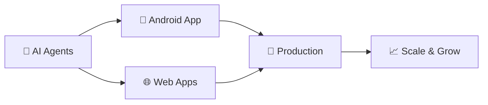

<p align="center">
  
</p>

<h1 align="center">
  
  Bandi Varun Goud
  
</h1>

<p align="center">
  <b>🤖 AI-Powered Developer | 📱 Android Creator | 🌐 Full-Stack Architect | 🚀 App Builder | 🧠 AI Agent Orchestrator</b>
</p>

<br>

<p align="center">
  
  
  
  
  
  
  
  
</p>

<p align="center">
  
  
  
  
  
  
</p>

---

## 🧠 My Dev Superpowers

```javascript
const Varun = {
  role: "AI-Assisted Full-Stack & Android Developer",
  workflow: "🤖 AI Agents + 👨‍💻 My Logic = 🚀 Fast Shipping",
  building: ["Web Apps", "Android Apps", "Cross-Platform Solutions"],
  aiTools: ["Cursor", "Copilot", "Claude", "GPT-4"],
  motto: "Why build alone when AI can be your co-founder?",
  funFact: "I ship projects in days, not months 🚀",
  goal: "Build 10+ apps by end of 2026"
};
```

---

## 🚀 Featured Projects

### 📱 Varun Campus Hub
> AI-assisted full-stack platform for campus resources and scientific materials

| Feature | Description |
|---------|-------------|
| 🔐 **Authentication** | Secure Firebase Auth (Email/Password + Social) |
| 📖 **Catalog** | Real-time book & resource search |
| ⭐ **Responsive** | Flawless on mobile, tablet, desktop |
| 🤖 **AI Assistance** | 60% code generated with AI agents |

- **[🌐 Live Demo](https://varuncampushub.vercel.app/)**
- **[📂 GitHub Repo](https://github.com/VarunGoud04/varuncampushub)**

---

### 🔐 Firebase Authentication System
> Complete authentication module built with AI acceleration

| Feature | Description |
|---------|-------------|
| 🛡️ **Security** | Email verification & password reset |
| 👤 **Profiles** | Full user profile management |
| 🔄 **Routes** | Protected routes in React |
| 🤖 **Speed** | Built 3x faster with AI pair programming |

- **[📂 GitHub Repo](https://github.com/VarunGoud04/firebase-auth-system)**

---

### 📱 Android App (In Development)
> Native Android application with modern stack

| Feature | Status |
|---------|--------|
| 🎨 Material Design 3 | 🔄 In Progress |
| 🔥 Firebase Backend | 🔄 In Progress |
| 🧠 AI-Powered Features | 📅 Planned |
| 📱 Play Store Release | 🎯 Q3 2026 |

- **[🚧 Building with AI Agents]**

---

## 🤖 How I Use AI Agents in My Workflow

| Task | AI Tool | Speed Gain | Why It Works |
|------|---------|------------|---------------|
| 🏗️ **Architecture Design** | Claude + GPT-4 | 5x faster | AI suggests optimal patterns |
| 💻 **Code Generation** | GitHub Copilot | 3x faster | Real-time suggestions |
| 🐛 **Bug Debugging** | Cursor AI | 10x faster | AI finds issues instantly |
| 📱 **UI/UX Suggestions** | AI Design Assistants | 4x faster | Modern interfaces in minutes |
| 🔐 **Security Checks** | AI Code Review | 2x safer | Catches vulnerabilities early |
| 📝 **Documentation** | AI Writers | 5x faster | Clean docs automatically |

---

## 📊 GitHub Analytics

<div align="center">
  
  
</div>

<br>

<div align="center">
  
</div>

<br>

<div align="center">
  
</div>

---

## 📈 AI-Assisted Dev Metrics

```yaml
🚀 My Building Stats (2024-2026):
╔════════════════════════╦════════════════════════╗
║ Web Apps Built         ║ 2 (and scaling!)       ║
║ Android Apps           ║ 1 (in progress)        ║
║ AI Code Assistance     ║ ~70% of my workflow    ║
║ Time Saved             ║ 60% ⚡                 ║
║ Weekly Commits         ║ 📈📈📈 Increasing       ║
║ Coffee Powered         ║ ☕☕☕ (∞)               ║
║ Lines of AI-generated  ║ 15,000+ (and counting) ║
╚════════════════════════╩════════════════════════╝
```

---

## 🎯 What I'm Currently Building



| Focus Area | Current Project | Tech Stack | Progress |
|------------|----------------|------------|----------|
| 📱 **Android** | Campus Hub Mobile | Kotlin, Firebase, Material 3 | 40% |
| 🌐 **Web** | Campus Hub Platform | React, Node.js, Firebase | 100% ✅ |
| 🔐 **Auth** | Auth System | React, Firebase Auth | 100% ✅ |
| 🤖 **AI Integration** | AI Features for Apps | GPT-4, Claude API | 25% |

---

## 🌐 Connect with Me

<p align="center">
  <a href="https://in.linkedin.com/in/bandi-varun-goud">
    
  </a>
  <a href="https://github.com/VarunGoud04">
    
  </a>
  <a href="mailto:bandivarungoud05@gmail.com">
    
  </a>
  <a href="https://varunhub.space">
    
  </a>
</p>

---

## 📞 Let's Collaborate

<p align="center">
  <b>I'm actively looking for:</b>
  <br>
  🤝 Full-Stack Developer Roles
  <br>
  🤝 Android Developer Positions
  <br>
  🤝 AI-Integrated App Projects
  <br>
  🤝 Open Source Contributions
</p>

---

## 💬 Random Dev Quote

<p align="center">
  
</p>

---

<p align="center">
  
  <span>⚡</span>
  
  <span>⚡</span>
  
</p>

<p align="center">
  <b><i>"I don't just code — I orchestrate AI agents to build apps faster, smarter, better."</i></b>
  <br>
  <br>
  🚀 *Open for collaborations | Let's build something amazing together*
  <br>
  📧 *Reach out: bandivarungoud05@gmail.com*
</p>

<p align="center">
  
</p>

---

<div align="center">
  
  ### ⭐ Show some love by starring my repos! ⭐
  
  ---
  
  **Built with 🧠 + 🤖 | Updated Daily | Let's Connect!**
  
</div>
```

---

